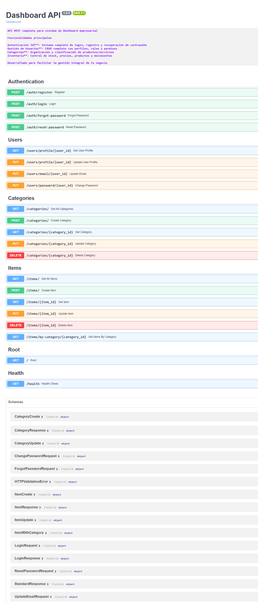

# Dashboard API - FastAPI

API REST desarrollada con FastAPI para el sistema de Dashboard con gestión de usuarios, categorías e inventario.

## Características

- ✅ **API RESTful** con FastAPI
- ✅ **Documentación automática** con Swagger/OpenAPI
- ✅ **Validación de datos** con Pydantic
- ✅ **CORS configurado** para frontend React VIte
- ✅ **Almacenamiento en memoria** (vectores/listas)
- ✅ **Manejo de errores** personalizado


## Entidades

### User (Usuario)
- Registro y autenticación de usuarios
- Gestión de perfiles de usuario
- Recuperación de contraseña con códigos temporales
- Cambio de email y contraseña

### Category (Categoría) 
- CRUD completo de categorías
- Validaciones de integridad referencial
- Prevención de eliminación con productos asociados

### Item (Producto/Inventario)
- CRUD completo de productos
- Relación con categorías
- Gestión de stock y precios
- Consultas por categoría

## 🛠 Instalación

### 1. Instalar dependencias
```bash
pip install -r requirements.txt
```

### 2. Ejecutar la aplicación
```bash
uvicorn main:app --reload
```

La API estará disponible en: `http://127.0.0.1:8000`

## Acceso a la Documentación

Una vez ejecutando la aplicación, acceder a:

- **Swagger UI**: http://127.0.0.1:8000/docs

## Endpoints Principales

### Autenticación (`/auth`)
| Método | Endpoint | Descripción |
|--------|----------|-------------|
| `POST` | `/auth/register` | Registro de usuarios |
| `POST` | `/auth/login` | Inicio de sesión |
| `POST` | `/auth/forgot-password` | Solicitar código de recuperación |
| `POST` | `/auth/reset-password` | Restablecer contraseña |

###  Usuarios (`/users`)
| Método | Endpoint | Descripción |
|--------|----------|-------------|
| `GET` | `/users/profile/{user_id}` | Obtener perfil de usuario |
| `PUT` | `/users/profile/{user_id}` | Actualizar perfil |
| `PUT` | `/users/email/{user_id}` | Cambiar email |
| `PUT` | `/users/password/{user_id}` | Cambiar contraseña |

### Categorías (`/categories`)
| Método | Endpoint | Descripción |
|--------|----------|-------------|
| `GET` | `/categories` | Listar todas las categorías |
| `GET` | `/categories/{category_id}` | Obtener categoría específica |
| `POST` | `/categories` | Crear nueva categoría |
| `PUT` | `/categories/{category_id}` | Actualizar categoría |
| `DELETE` | `/categories/{category_id}` | Eliminar categoría |

### Items/Productos (`/items`)
| Método | Endpoint | Descripción |
|--------|----------|-------------|
| `GET` | `/items` | Listar todos los productos |
| `GET` | `/items/{item_id}` | Obtener producto específico |
| `GET` | `/items/by-category/{category_id}` | Productos por categoría |
| `POST` | `/items` | Crear nuevo producto |
| `PUT` | `/items/{item_id}` | Actualizar producto |
| `DELETE` | `/items/{item_id}` | Eliminar producto |

## Arquitectura del Proyecto

```
dashboard-api/
├── main.py                 # Aplicación principal FastAPI
├── requirements.txt        # Dependencias del proyecto
├── README.md              # Este archivo
├── models/                # Modelos Pydantic
│   ├── __init__.py
│   ├── user.py           # Modelos de Usuario
│   ├── category.py       # Modelos de Categoría
│   └── item.py           # Modelos de Item
├── routers/              # Rutas de la API
│   ├── __init__.py
│   ├── auth.py           # Rutas de autenticación
│   ├── users.py          # Rutas de usuarios
│   ├── categories.py     # Rutas de categorías
│   └── items.py          # Rutas de items
└── storage/              # Almacenamiento en memoria
    ├── __init__.py
    └── memory_storage.py  # Lógica de almacenamiento
```


## CORS Configuración

La API está configurada para aceptar conexiones desde:
- `http://localhost:5173` (Vite dev server)

*Documentación automática generada por FastAPI mostrando todos los endpoints disponibles*
